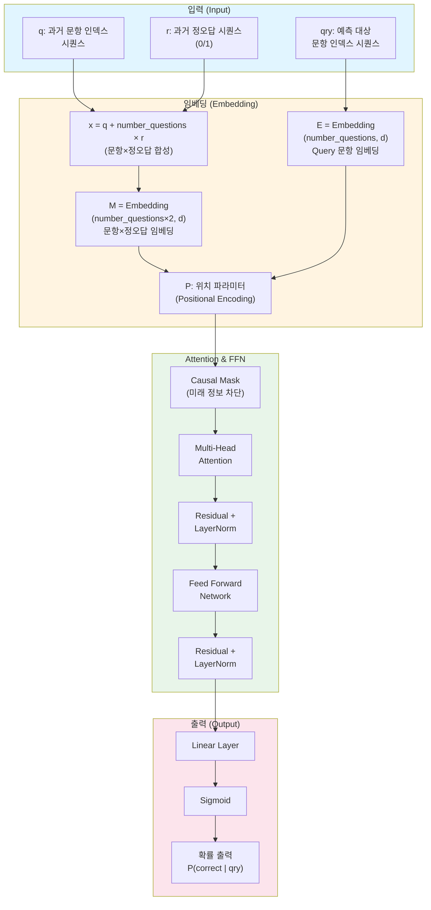

# SAKT (Self-Attentive Knowledge Tracing) 모델 아키텍처

## 모델 구조 개요

SAKT 모델은 Transformer 기반의 지식 추적(Knowledge Tracing) 모델로, 학습자의 과거 문제 풀이 이력을 바탕으로 다음 문제의 정답 여부를 예측합니다.

---

## SAKT 아키텍처 다이어그램



---

## 상세 구조 설명

### 4.1 입력/임베딩

#### 입력 시퀀스
- **q**: 과거 문항 인덱스 시퀀스 `[q₁, q₂, ..., qₜ]`
- **r**: 과거 정오답 시퀀스 `[r₁, r₂, ..., rₜ]` (0=오답, 1=정답)
- **qry**: 예측 대상 문항 인덱스 시퀀스 `[qry₁, qry₂, ..., qryₘ]`

#### 결합 (Combination)
```
x = q + number_questions × r
```
- 문항 인덱스와 정오답 상태를 단일 토큰 공간으로 합성
- 예: `q=3, r=1` → `x = 3 + N×1 = 3+N` (N = number_questions)

#### 임베딩 레이어
- **M**: `Embedding(number_questions×2, d)` 
  - 문항×정오답 조합을 d차원 벡터로 변환
  - 입력: 합성된 토큰 `x`
  
- **E**: `Embedding(number_questions, d)`
  - Query 문항을 d차원 벡터로 변환
  - 입력: `qry`
  
- **P**: 위치 파라미터 (Positional Encoding)
  - 시퀀스의 위치 정보 추가

---

### 4.2 Attention / FFN / Prediction

#### Multi-Head Attention
1. **Causal Mask 적용**
   - 미래 정보 차단 (과거 정보만 참조)
   - Mask 행렬: `M[i,j] = -∞ if j > i, else 0`

2. **Multi-Head Attention 수행**
   - Query: E (예측 대상 문항)
   - Key, Value: M (과거 문항×정오답 이력)
   - 여러 헤드로 병렬 처리

#### Feed Forward Network (FFN)
```
FFN(x) = ReLU(W₁x + b₁)W₂ + b₂
```

#### 출력 레이어
```
P(correct | qry) = sigmoid(Linear(hidden))
```
- Linear 레이어로 스칼라 값 생성
- Sigmoid로 [0, 1] 확률로 변환

---

## 데이터 흐름도

```
입력 단계:
  q = [1, 2, 3]           (과거 문항 인덱스)
  r = [1, 0, 1]           (과거 정오답: 정답, 오답, 정답)
  qry = [4]               (예측 대상 문항)

임베딩 단계:
  x = [1+N, 2, 3+N]       (합성 토큰, N=number_questions)
  M(x) → [emb₁, emb₂, emb₃]  (d차원 벡터들)
  E(qry) → [emb_qry]      (d차원 벡터)
  P → 위치 정보 추가

Attention 단계:
  Q = E(qry) + P
  K, V = M(x) + P
  Attention(Q, K, V) with Causal Mask
  → [hidden₁, hidden₂, hidden₃]

FFN 단계:
  hidden → FFN → LayerNorm → [hidden']

출력 단계:
  hidden' → Linear → logit
  logit → Sigmoid → P(correct | qry=4) ∈ [0, 1]
```

---

## 모델 특징

### 주요 구성 요소

| 구성 요소 | 설명 |
|:---------|:-----|
| **입력 결합** | 문항 인덱스와 정오답을 단일 토큰 공간으로 합성 |
| **임베딩** | 문항×정오답 조합과 Query 문항을 각각 임베딩 |
| **Causal Mask** | 미래 정보를 차단하여 과거 정보만 참조 |
| **Multi-Head Attention** | 여러 헤드로 병렬 처리하여 다양한 관점에서 학습 |
| **Residual Connection** | 학습 안정성 향상 |
| **Layer Normalization** | 정규화를 통한 학습 안정화 |
| **FFN** | 비선형 변환을 통한 표현력 향상 |

### 장점

- **시퀀스 모델링**: Transformer 기반으로 장기 의존성 학습 가능
- **효율적인 임베딩**: 문항과 정오답을 단일 공간으로 합성하여 효율적 처리
- **Causal 구조**: 미래 정보를 차단하여 실제 추론 환경과 일치
- **확장성**: 다양한 길이의 시퀀스 처리 가능

---

## 참고 자료

- SAKT: Self-Attentive Knowledge Tracing (Pandey & Karypis, 2019)
- Transformer Architecture (Vaswani et al., 2017)

