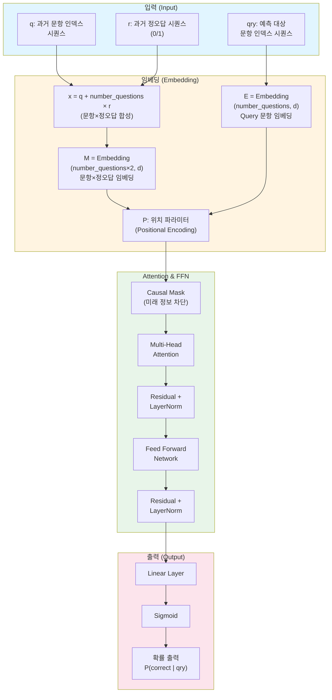

# SAKT 모델 아키텍처 정의서
## (Self-Attentive Knowledge Tracing Architecture Specification)

---

## 문서 정보

| 항목 | 내용 |
|:-----|:-----|
| **문서명** | SAKT 모델 아키텍처 정의서 |
| **버전** | 1.0 |
| **작성일** | 2024년 |
| **목적** | SAKT 모델의 아키텍처 구조, 구성 요소, 데이터 흐름을 명확히 정의 |
| **대상 독자** | 개발자, 연구자, 시스템 설계자 |

---

## 1. 목적 및 범위

### 1.1 목적
본 문서는 SAKT (Self-Attentive Knowledge Tracing) 모델의 아키텍처를 상세히 정의하여, 모델의 구조, 구성 요소, 데이터 흐름, 알고리즘을 명확히 기술합니다.

### 1.2 범위
- 모델의 전체 아키텍처 구조
- 각 구성 요소의 상세 명세
- 데이터 입력/출력 형식
- 처리 알고리즘 및 흐름
- 기술 스택 및 구현 요구사항

### 1.3 제외 사항
- 학습 알고리즘 상세 (Optimizer, Loss Function 등)
- 데이터 전처리 및 후처리 과정
- 배포 및 운영 환경 구성

---

## 2. 시스템 개요

### 2.1 모델 개요
SAKT는 Transformer 아키텍처를 기반으로 한 지식 추적(Knowledge Tracing) 모델로, 학습자의 과거 문제 풀이 이력을 분석하여 다음 문제의 정답 여부를 확률로 예측합니다.

### 2.2 주요 특징
- **시퀀스 기반 모델링**: 학습자의 과거 풀이 이력을 시퀀스로 처리
- **Self-Attention 메커니즘**: 장기 의존성 학습 및 문맥 이해
- **Causal 구조**: 미래 정보를 차단하여 실제 추론 환경과 일치
- **효율적인 임베딩**: 문항과 정오답을 단일 토큰 공간으로 합성

### 2.3 입력/출력
- **입력**:
  - `q`: 과거 문항 인덱스 시퀀스 `[q₁, q₂, ..., qₜ]`
  - `r`: 과거 정오답 시퀀스 `[r₁, r₂, ..., rₜ]` (0=오답, 1=정답)
  - `qry`: 예측 대상 문항 인덱스 시퀀스 `[qry₁, qry₂, ..., qryₘ]`
- **출력**:
  - `P(correct | qry)`: 정답 확률 `[0, 1]`

---

## 3. 아키텍처 다이어그램



---

## 4. 구성 요소 상세 명세

### 4.1 입력 레이어 (Input Layer)

#### 4.1.1 입력 데이터 구조

| 변수명 | 타입 | 설명 | 예시 |
|:-------|:-----|:-----|:-----|
| `q` | `List[int]` | 과거 문항 인덱스 시퀀스 | `[1, 2, 3, 5, 2]` |
| `r` | `List[int]` | 과거 정오답 시퀀스 (0=오답, 1=정답) | `[1, 0, 1, 1, 0]` |
| `qry` | `List[int]` | 예측 대상 문항 인덱스 시퀀스 | `[4]` |

**제약사항**:
- `q`와 `r`의 길이는 동일해야 함
- 모든 인덱스는 `[0, number_questions-1]` 범위 내
- `r`의 값은 반드시 `0` 또는 `1`

#### 4.1.2 입력 검증
```python
def validate_input(q, r, qry, number_questions):
    assert len(q) == len(r), "q와 r의 길이가 일치해야 합니다"
    assert all(0 <= q_i < number_questions for q_i in q), "q 인덱스 범위 오류"
    assert all(0 <= qry_i < number_questions for qry_i in qry), "qry 인덱스 범위 오류"
    assert all(r_i in [0, 1] for r_i in r), "r은 0 또는 1이어야 합니다"
```

---

### 4.2 임베딩 레이어 (Embedding Layer)

#### 4.2.1 토큰 합성 (Token Combination)

**수식**:
```
x = q + number_questions × r
```

**목적**: 문항 인덱스와 정오답 상태를 단일 토큰 공간으로 합성

**예시**:
- `q = 3`, `r = 1`, `number_questions = 100`
- `x = 3 + 100 × 1 = 103`
- 결과: 문항 3을 정답으로 푼 경우 → 토큰 103

**토큰 공간**:
- `[0, number_questions-1]`: 문항 인덱스 (오답)
- `[number_questions, 2×number_questions-1]`: 문항 인덱스 (정답)

#### 4.2.2 임베딩 레이어 명세

##### M: 문항×정오답 임베딩
```python
M = Embedding(
    num_embeddings=number_questions * 2,
    embedding_dim=d
)
```

| 파라미터 | 값 | 설명 |
|:---------|:---|:-----|
| `num_embeddings` | `number_questions × 2` | 임베딩 테이블 크기 |
| `embedding_dim` | `d` | 임베딩 벡터 차원 |
| 입력 | `x` (합성된 토큰) | `[batch_size, seq_len]` |
| 출력 | `M(x)` | `[batch_size, seq_len, d]` |

##### E: Query 문항 임베딩
```python
E = Embedding(
    num_embeddings=number_questions,
    embedding_dim=d
)
```

| 파라미터 | 값 | 설명 |
|:---------|:---|:-----|
| `num_embeddings` | `number_questions` | 임베딩 테이블 크기 |
| `embedding_dim` | `d` | 임베딩 벡터 차원 |
| 입력 | `qry` | `[batch_size, query_len]` |
| 출력 | `E(qry)` | `[batch_size, query_len, d]` |

##### P: 위치 인코딩 (Positional Encoding)
```python
P = PositionalEncoding(
    d_model=d,
    max_len=max_sequence_length
)
```

**목적**: 시퀀스의 위치 정보를 임베딩 벡터에 추가

**구현 방식**:
- 학습 가능한 위치 임베딩 (Learned Positional Embedding)
- 또는 사인/코사인 기반 위치 인코딩 (Sinusoidal Positional Encoding)

**출력**: `[batch_size, seq_len, d]`

---

### 4.3 Attention 레이어

#### 4.3.1 Causal Mask

**목적**: 미래 정보를 차단하여 과거 정보만 참조

**Mask 행렬 정의**:
```
M[i, j] = {
    -∞  if j > i  (미래 정보 차단)
    0   otherwise (과거 정보 허용)
}
```

**구현**:
```python
def create_causal_mask(seq_len):
    mask = torch.triu(torch.ones(seq_len, seq_len), diagonal=1)
    mask = mask.masked_fill(mask == 1, float('-inf'))
    return mask
```

#### 4.3.2 Multi-Head Attention

**수식**:
```
Attention(Q, K, V) = softmax(QK^T / √d_k + Mask) V
```

**구성 요소**:
- **Query (Q)**: `E(qry) + P` - 예측 대상 문항
- **Key (K)**: `M(x) + P` - 과거 문항×정오답 이력
- **Value (V)**: `M(x) + P` - 과거 문항×정오답 이력

**파라미터**:
| 파라미터 | 설명 | 기본값 |
|:---------|:-----|:-------|
| `d_model` | 모델 차원 | `d` |
| `num_heads` | Attention 헤드 수 | `8` |
| `dropout` | Dropout 비율 | `0.1` |

**출력**: `[batch_size, query_len, d]`

---

### 4.4 Feed Forward Network (FFN)

#### 4.4.1 구조
```python
FFN(x) = ReLU(W₁x + b₁)W₂ + b₂
```

**레이어 구성**:
1. **Linear Layer 1**: `d → d_ff`
2. **ReLU Activation**
3. **Dropout** (선택적)
4. **Linear Layer 2**: `d_ff → d`

**파라미터**:
| 파라미터 | 설명 | 기본값 |
|:---------|:-----|:-------|
| `d_model` | 입력/출력 차원 | `d` |
| `d_ff` | FFN 내부 차원 | `4 × d` |
| `dropout` | Dropout 비율 | `0.1` |

#### 4.4.2 Residual Connection & Layer Normalization

**구조**:
```
output = LayerNorm(x + Sublayer(x))
```

**적용 위치**:
1. Multi-Head Attention 후
2. FFN 후

**목적**:
- **Residual Connection**: 그래디언트 흐름 개선, 학습 안정성 향상
- **Layer Normalization**: 정규화를 통한 학습 안정화

---

### 4.5 출력 레이어 (Output Layer)

#### 4.5.1 Linear Layer
```python
Linear(in_features=d, out_features=1)
```

**입력**: `[batch_size, query_len, d]`  
**출력**: `[batch_size, query_len, 1]`

#### 4.5.2 Sigmoid Activation
```python
P(correct | qry) = sigmoid(Linear(hidden))
```

**출력 범위**: `[0, 1]`  
**의미**: 주어진 문항(`qry`)에 대해 정답일 확률

---

## 5. 데이터 흐름 및 처리 과정

### 5.1 전체 처리 흐름

```
1. 입력 단계
   q = [1, 2, 3]           (과거 문항 인덱스)
   r = [1, 0, 1]           (과거 정오답: 정답, 오답, 정답)
   qry = [4]               (예측 대상 문항)

2. 토큰 합성
   x = [1+N, 2, 3+N]       (합성 토큰, N=number_questions)

3. 임베딩 단계
   M(x) → [emb₁, emb₂, emb₃]  (d차원 벡터들, [batch, 3, d])
   E(qry) → [emb_qry]      (d차원 벡터, [batch, 1, d])
   P → 위치 정보 추가

4. Attention 단계
   Q = E(qry) + P          ([batch, 1, d])
   K, V = M(x) + P         ([batch, 3, d])
   Attention(Q, K, V) with Causal Mask
   → [hidden]              ([batch, 1, d])

5. Residual & LayerNorm
   hidden = LayerNorm(hidden + attention_output)

6. FFN 단계
   hidden → FFN → LayerNorm
   → [hidden']             ([batch, 1, d])

7. 출력 단계
   hidden' → Linear → logit ([batch, 1, 1])
   logit → Sigmoid → P(correct | qry=4) ∈ [0, 1]
```

### 5.2 배치 처리

모든 레이어는 배치 처리를 지원:
- 입력: `[batch_size, seq_len]`
- 임베딩 후: `[batch_size, seq_len, d]`
- 출력: `[batch_size, query_len, 1]`

---

## 6. 하이퍼파라미터 명세

### 6.1 모델 하이퍼파라미터

| 파라미터 | 설명 | 기본값 | 범위 |
|:---------|:-----|:------|:-----|
| `number_questions` | 전체 문항 수 | - | `> 0` |
| `d` | 모델 차원 (임베딩 차원) | `256` | `[64, 512]` |
| `num_heads` | Attention 헤드 수 | `8` | `[4, 16]` |
| `d_ff` | FFN 내부 차원 | `4 × d` | `[2×d, 8×d]` |
| `dropout` | Dropout 비율 | `0.1` | `[0.0, 0.5]` |
| `max_seq_len` | 최대 시퀀스 길이 | `200` | `[50, 500]` |

### 6.2 학습 하이퍼파라미터 (참고)

| 파라미터 | 설명 | 기본값 |
|:---------|:-----|:------|
| `learning_rate` | 학습률 | `0.001` |
| `batch_size` | 배치 크기 | `32` |
| `num_epochs` | 에폭 수 | `50` |
| `optimizer` | 최적화 알고리즘 | `Adam` |

---

## 7. 인터페이스 정의

### 7.1 모델 인터페이스

```python
class SAKT(nn.Module):
    def __init__(
        self,
        number_questions: int,
        d: int = 256,
        num_heads: int = 8,
        d_ff: int = None,
        dropout: float = 0.1,
        max_seq_len: int = 200
    ):
        """
        Args:
            number_questions: 전체 문항 수
            d: 모델 차원
            num_heads: Attention 헤드 수
            d_ff: FFN 내부 차원 (None이면 4×d)
            dropout: Dropout 비율
            max_seq_len: 최대 시퀀스 길이
        """
        pass
    
    def forward(
        self,
        q: torch.Tensor,      # [batch, seq_len]
        r: torch.Tensor,      # [batch, seq_len]
        qry: torch.Tensor     # [batch, query_len]
    ) -> torch.Tensor:
        """
        Args:
            q: 과거 문항 인덱스 시퀀스
            r: 과거 정오답 시퀀스 (0/1)
            qry: 예측 대상 문항 인덱스 시퀀스
        
        Returns:
            P(correct | qry): [batch, query_len, 1]
        """
        pass
```

### 7.2 사용 예시

```python
# 모델 초기화
model = SAKT(
    number_questions=100,
    d=256,
    num_heads=8,
    dropout=0.1
)

# 입력 데이터
q = torch.tensor([[1, 2, 3]])      # [batch=1, seq_len=3]
r = torch.tensor([[1, 0, 1]])      # [batch=1, seq_len=3]
qry = torch.tensor([[4]])          # [batch=1, query_len=1]

# 추론
prob = model(q, r, qry)            # [batch=1, query_len=1, 1]
print(f"정답 확률: {prob.item():.4f}")
```

---

## 8. 성능 요구사항

### 8.1 계산 복잡도

| 연산 | 시간 복잡도 | 공간 복잡도 |
|:-----|:-----------|:-----------|
| 임베딩 | `O(seq_len × d)` | `O(seq_len × d)` |
| Attention | `O(seq_len² × d)` | `O(seq_len²)` |
| FFN | `O(seq_len × d × d_ff)` | `O(seq_len × d_ff)` |
| 전체 | `O(seq_len² × d)` | `O(seq_len² + seq_len × d)` |

### 8.2 메모리 요구사항

**근사치 계산**:
```
모델 파라미터 수 ≈ (number_questions × 2 + number_questions) × d
                 + d² × num_heads × 4
                 + d × d_ff × 2
                 + d_ff × d

예시 (number_questions=100, d=256, num_heads=8, d_ff=1024):
≈ 100,000 파라미터
≈ 400KB (float32 기준)
```

### 8.3 추론 속도

- **목표**: 배치 크기 32, 시퀀스 길이 100 기준
  - CPU: < 100ms
  - GPU: < 10ms

---

## 9. 제약사항 및 고려사항

### 9.1 제약사항
1. **시퀀스 길이 제한**: `max_seq_len`을 초과하는 시퀀스는 처리 불가
2. **문항 수 고정**: 모델 초기화 시 `number_questions`가 고정됨
3. **Causal 구조**: 미래 정보를 사용할 수 없음 (의도된 설계)

### 9.2 고려사항
1. **패딩 처리**: 시퀀스 길이가 다른 경우 패딩 필요
2. **마스킹**: 패딩된 부분은 Attention에서 제외해야 함
3. **배치 처리**: 배치 내 최대 시퀀스 길이에 맞춰 패딩 필요

---

## 10. 확장 가능성

### 10.1 가능한 확장 방향
1. **다중 문항 예측**: 여러 문항에 대한 동시 예측
2. **시간 정보 추가**: 문제 풀이 시간 정보 통합
3. **문항 난이도 통합**: IRT 지표 등 추가 피처 활용
4. **계층적 Attention**: 문항-개념-학습자 계층 구조

### 10.2 변형 모델
- **SAINT**: SAKT의 개선 버전 (Encoder-Decoder 구조)
- **AKT**: Adaptive Knowledge Tracing (문항 난이도 통합)

---

## 11. 참고 자료

### 11.1 논문
- Pandey, S., & Karypis, G. (2019). A self-attentive model for knowledge tracing. *arXiv preprint arXiv:1907.06837*.
- Vaswani, A., et al. (2017). Attention is all you need. *Advances in neural information processing systems*, 30.

### 11.2 관련 자료
- Transformer Architecture: [Attention Is All You Need](https://arxiv.org/abs/1706.03762)
- Knowledge Tracing: [Deep Knowledge Tracing](https://papers.nips.cc/paper/5654-deep-knowledge-tracing)

---

## 부록 A: 수식 정리

### A.1 토큰 합성
```
x_i = q_i + number_questions × r_i
```

### A.2 임베딩
```
M(x) = Embedding(x)  ∈ ℝ^(seq_len × d)
E(qry) = Embedding(qry)  ∈ ℝ^(query_len × d)
```

### A.3 Attention
```
Q = E(qry) + P
K = M(x) + P
V = M(x) + P

Attention(Q, K, V) = softmax((QK^T) / √d_k + Mask) V
```

### A.4 FFN
```
FFN(x) = ReLU(W₁x + b₁)W₂ + b₂
```

### A.5 출력
```
P(correct | qry) = sigmoid(W₃ · hidden + b₃)
```

---

## 부록 B: 용어 정의

| 용어 | 정의 |
|:-----|:-----|
| **Knowledge Tracing** | 학습자의 지식 상태를 추적하는 작업 |
| **Self-Attention** | 시퀀스 내 요소 간의 상호작용을 학습하는 메커니즘 |
| **Causal Mask** | 미래 정보를 차단하는 마스크 |
| **Embedding** | 이산적 토큰을 연속 벡터로 변환 |
| **Residual Connection** | 입력을 출력에 직접 더하는 연결 |
| **Layer Normalization** | 레이어 단위 정규화 |

---

**문서 버전**: 1.0  
**최종 수정일**: 2024년  
**작성자**: AI Assistant

