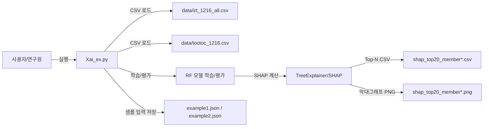

# 네트워크/구성도(요약) — 1차년도 최소 증빙용

## 1. 구성도 목적
- 1차년도 산출물(로컬 실행 기반 xAI+SHAP 파이프라인)과 2차년도 목표(Agent/RAG/SaaS 운영화)를 **네트워크/구성 관점에서 설명**하기 위한 요약 구성도

## 2. 1차년도(로컬/단일 노드) 구성



## 3. 2차년도(운영화 목표) 구성(권장 아키텍처)
> 예시 PPT의 “클라우드 아키텍처/Agent 워크플로우” 형태를 참고하여, 2차년도 목표(Agent, RAG, SaaS)를 반영한 목표 구성도임.

```mermaid
flowchart TB
  subgraph Client[클라이언트]
    UI[대화형 설명 인터페이스(xUI)]
  end

  subgraph SaaS[SaaS 플랫폼/백엔드]
    API[Platform API]
    Auth[인증/권한]
    Log[로그/모니터링]
  end

  subgraph AI[AI 서비스]
    Pred[예측 서비스(xAI 모델)]
    Expl[해석/설명 서비스(SHAP/설명 생성)]
    Agent[LLM Agent]
    RAG[RAG Retriever]
  end

  subgraph Data[데이터/저장소]
    FeatureDB[(학습/로그 DB)]
    ExplainDB[(해석/설명 구조화 DB)]
    VecDB[(Vector DB)]
    DocStore[(문서/가이드 저장소)]
  end

  UI --> API
  API --> Auth
  API --> Pred
  Pred --> FeatureDB
  Pred --> Expl
  Expl --> ExplainDB
  Expl --> Agent
  Agent --> RAG
  RAG --> VecDB
  DocStore --> VecDB
  API --> Log
```

## 4. 증빙(현재 확보)
- 1차년도 로컬 파이프라인 산출물: `Xai_ex.py`, `shap_top20_member*.csv/png`, `example*.json`


