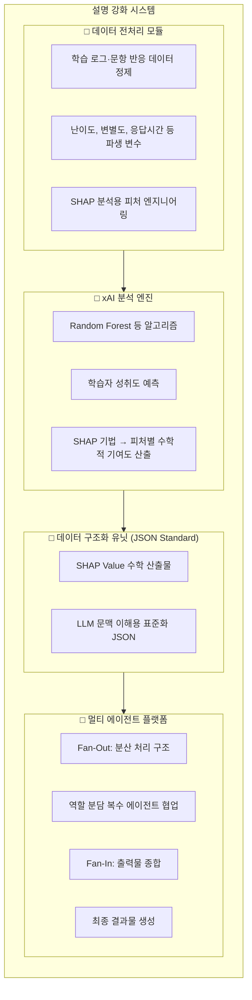

# 설명 강화 시스템 아키텍처 및 구성 요소 (Mermaid)

아래 Mermaid 코드를 [Mermaid Live Editor](https://mermaid.live) 등에서 렌더링 후 PNG/SVG로 내보내면 발표·보고서용 그림으로 사용할 수 있습니다.

---

## 가. 전체 시스템 아키텍처 (처리 흐름)

```mermaid
flowchart LR
    subgraph 입력
        A[학습 로그·문항 반응 데이터]
    end

    subgraph 데이터_전처리_모듈["□ 데이터 전처리 모듈"]
        B[정제]
        C[난이도·변별도·응답시간 등 파생변수]
        D[피처 엔지니어링]
    end

    subgraph xAI_분석_엔진["□ xAI 분석 엔진"]
        E[Random Forest 등 예측]
        F[SHAP 기법 적용]
        G[피처별 수학적 기여도 산출]
    end

    subgraph 데이터_구조화["□ 데이터 구조화 유닛 (JSON Standard)"]
        H[SHAP Value → 표준화 JSON]
        I[LLM 문맥 이해용 구조화]
    end

    subgraph 멀티_에이전트["□ 멀티 에이전트 플랫폼"]
        J[Fan-Out 분산 처리]
        K[역할 분담 복수 에이전트 협업]
        L[Fan-In 종합]
        M[최종 자연어 피드백]
    end

    A --> B --> C --> D --> E --> F --> G --> H --> I --> J --> K --> L --> M
```

---

## 나. 구성 요소 구조도 (블록형)

---

## 참고: 본 발명 구성 요소 요약

| 구성 요소 | 설명 |
|-----------|------|
| **데이터 전처리 모듈** | 학습 로그 및 문항 반응 데이터 정제, 난이도·변별도·응답시간 등 파생 변수 생성, SHAP 분석용 피처 엔지니어링 |
| **xAI 분석 엔진** | Random Forest 등으로 성취도 예측, SHAP로 각 피처의 수학적 기여도 산출 |
| **데이터 구조화 유닛 (JSON)** | SHAP Value를 LLM이 문맥적으로 이해할 수 있도록 표준화된 JSON으로 변환 |
| **멀티 에이전트 플랫폼** | Fan-Out 분산 처리, 역할 분담 에이전트 협업, Fan-In 종합으로 최종 결과물 생성 |

---

*Mermaid PNG 내보내기: VS Code Mermaid 확장 또는 https://mermaid.live 에서 코드 붙여넣기 후 Export.*
