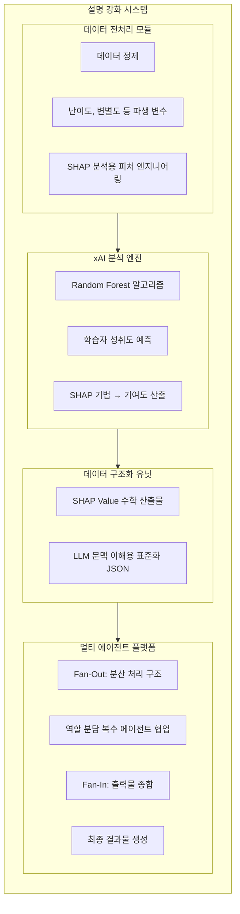
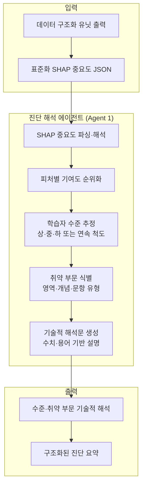
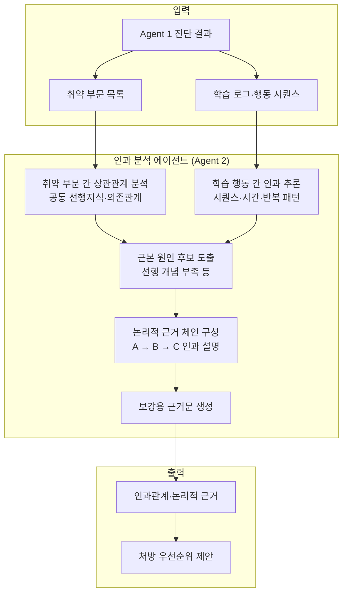
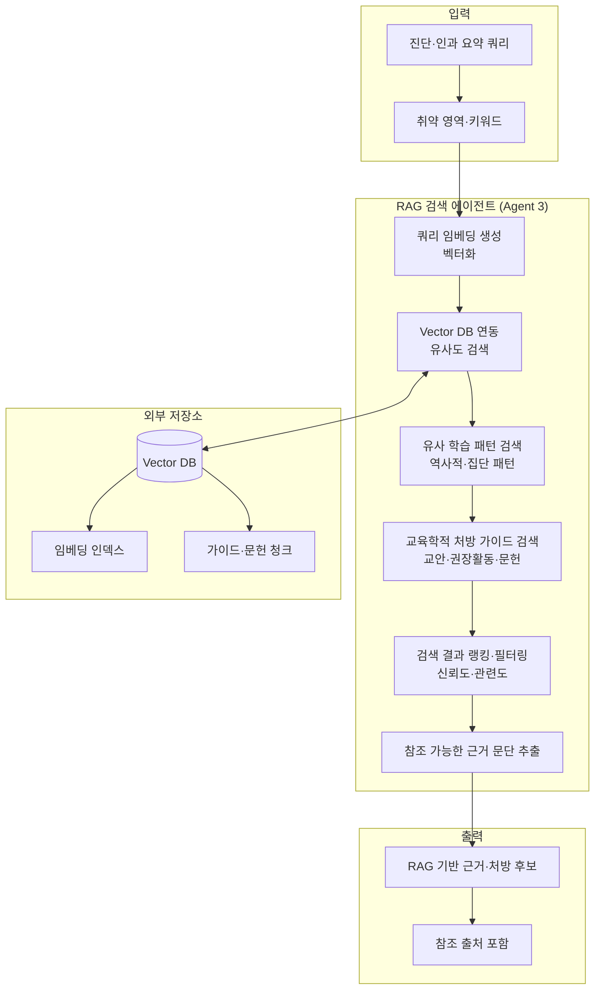
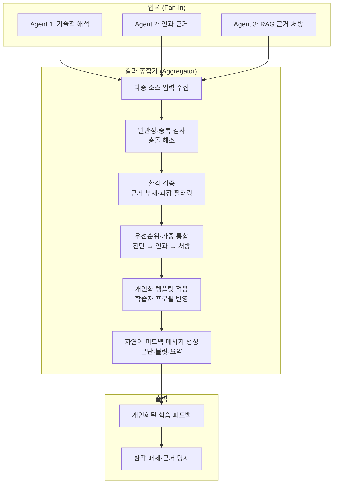
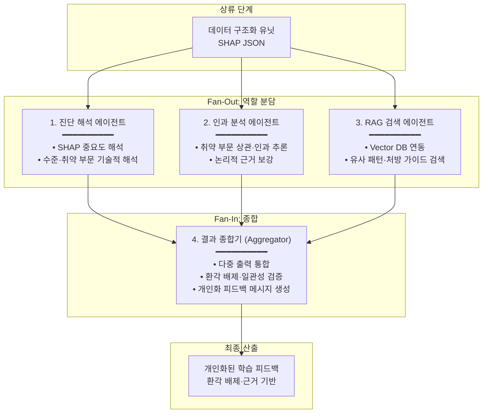

# 설명 강화 시스템 아키텍처 및 구성 요소 (Mermaid)

---

## 가. 전체 시스템 아키텍처 (처리 흐름)

```mermaid
flowchart LR
    subgraph 입력
        A[학습 로그·문항 반응 데이터]
    end

    subgraph 데이터_전처리_모듈["데이터 전처리 모듈"]
        B[정제]
        C[난이도·변별도·응답시간 등 파생변수]
        D[피처 엔지니어링]
    end

    subgraph xAI_분석_엔진["xAI 분석 엔진"]
        E[Random Forest 등 예측]
        F[SHAP 기법 적용]
        G[피처별 수학적 기여도 산출]
    end

    subgraph 데이터_구조화["데이터 구조화 유닛"]
        H[SHAP Value → 표준화 JSON]
        I[LLM 문맥 이해용 구조화]
    end

    subgraph 멀티_에이전트["멀티 에이전트 플랫폼"]
        J[Fan-Out 분산 처리]
        K[역할 분담 복수 에이전트 협업]
        L[Fan-In 종합]
        M[최종 자연어 피드백]
    end

    A --> B --> C --> D --> E --> F --> G --> H --> I --> J --> K --> L --> M
```

---

## 나. 구성 요소 구조도 (블록형)

---

## 나. 멀티 에이전트 기반 협업 프로세스

### 1. 진단 해석 에이전트 (Agent 1) 구조도

---

### 2. 인과 분석 에이전트 (Agent 2) 구조도

---

### 3. RAG 검색 에이전트 (Agent 3) 구조도

---

### 4. 결과 종합기 (Aggregator) 구조도

---

### 5. 멀티 에이전트 협업 프로세스 전체 구조도

---

### 참고: 멀티 에이전트 역할 요약

| 구성 요소 | 역할 | 핵심 산출물 |
|-----------|------|-------------|
| **Agent 1 (진단 해석)** | 데이터 구조화 유닛의 SHAP 중요도 분석 → 학습자 수준·취약 부문 기술적 해석 | 수준 추정, 취약 영역 목록, 기술적 해석문 |
| **Agent 2 (인과 분석)** | 취약 부문 간 상관·학습 행동 간 인과 추론 → 논리적 근거 보강 | 인과 체인, 근거문, 처방 우선순위 |
| **Agent 3 (RAG 검색)** | Vector DB 연동, 유사 학습 패턴·교육학적 처방 가이드 검색 → 신뢰성 확보 | RAG 기반 근거·처방 후보, 참조 출처 |
| **결과 종합기** | 에이전트 1~3 산출물 통합, 환각 배제, 개인화 피드백 메시지 생성 | 최종 자연어 피드백 |

---

## 참고: 본 발명 구성 요소 요약

| 구성 요소 | 설명 |
|-----------|------|
| **데이터 전처리 모듈** | 학습 로그 및 문항 반응 데이터 정제, 난이도·변별도·응답시간 등 파생 변수 생성, SHAP 분석용 피처 엔지니어링 |
| **xAI 분석 엔진** | Random Forest 등으로 성취도 예측, SHAP로 각 피처의 수학적 기여도 산출 |
| **데이터 구조화 유닛 (JSON)** | SHAP Value를 LLM이 문맥적으로 이해할 수 있도록 표준화된 JSON으로 변환 |
| **멀티 에이전트 플랫폼** | Fan-Out 분산 처리, 역할 분담 에이전트 협업, Fan-In 종합으로 최종 결과물 생성 |

---

